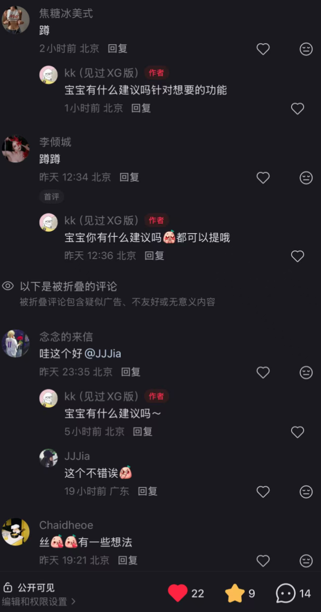
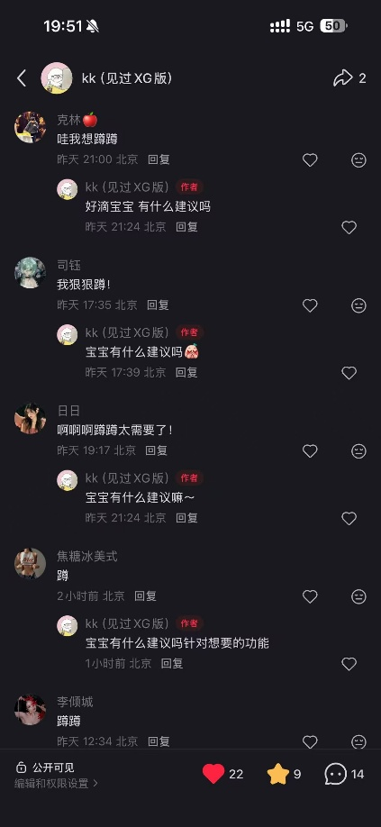
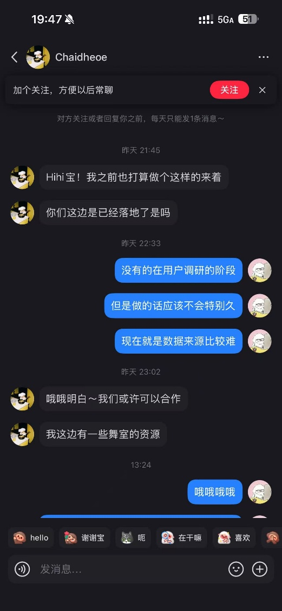
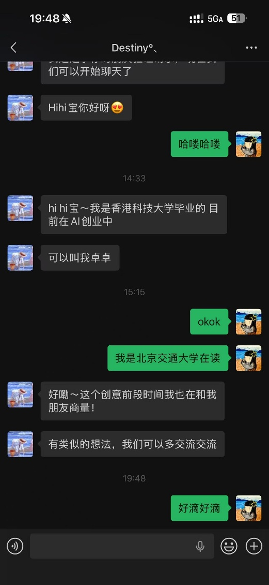

# 舞蹈学习与约练平台产品立项建议书

## 一、项目概述

### 1.1 项目名称

BitDance

### 1.2 项目定位

BitDance是一款面向舞蹈爱好者的舞蹈学习与约练平台，围绕找舞室、选课程、约搭子、持续练习和成长记录五个核心环节，提供比现有地图平台、点评平台和短视频平台更完整的决策与学习支持。

平台的首要目标不是做一个泛社交社区，也不是做普通的内容平台，而是围绕舞蹈学习者的真实路径建立一条清晰的服务链路：先帮助用户找到适合自己的舞室和课程，再帮助用户找到同伴和练习节奏，最后通过成长记录和内容沉淀提高长期留存。

### 1.3 立项结论

舞蹈学习并不是一次性消费，而是兼具兴趣、健身、社交和自我表达属性的长期行为。当前用户在找舞室、比课程、看评价、找搭子和坚持练习的过程中，要在多个平台之间来回切换，信息分散、判断困难、试错成本高。本项目的价值就在于把这些分散需求整合成一个围绕舞蹈学习路径设计的垂直平台。对于开发团队而言，这一方向技术边界清晰、实现路径明确、商业模式具备现实空间，属于典型的软件工程项目。

## 二、为什么应当投入资源做这个项目

### 2.1 真实需求已经存在，而且持续存在

舞蹈学习需求具有长期性。许多用户并不是一次性体验，而是从尝试某一舞种开始，逐步进入报班、上课、练习、拍作品、找搭子和持续训练的循环。只要用户开始学舞，后续就会持续产生课程查询、舞室比较、同伴连接和成长记录等一系列需求。

从消费侧看，国家统计局发布的《2025年居民收入和消费支出情况》显示，2025年全国居民人均教育文化娱乐消费支出为 3489 元，同比增长 9.4%。[参考1](#参考1) 这说明文化娱乐与兴趣学习相关支出仍在增长，围绕舞蹈这种兼具兴趣、健身和线下体验属性的细分场景，存在现实的消费基础。

如果进一步缩小到年轻化舞种，市场基础并不弱。中国舞蹈家协会街舞委员会发布的《中国街舞产业发展研究报告》显示，截至 2023 年，CHUC 体系已覆盖全国 596 个城市，拥有近 10000 家街舞教育培训机构、近 300 万从业者，每年学习街舞的人次超过 1000 万；报告同时指出，街舞教育培训已成为街舞产业最重要的组成部分之一，Z 世代是街舞产业最核心的目标群体。[参考3](#参考3) 这意味着街舞、Hiphop、Urban、Locking、Breaking 等面向青年群体的舞种，已经具备稳定供给、明确消费人群和持续扩张的培训需求。

从大众参与和社会认知侧看，街舞也在持续从圈层文化走向主流场景。国家体育总局办公厅在关于高校共建奥运会新兴项目后备人才培养体系的答复中明确提到，霹雳舞是 2024 年巴黎奥运会新增项目，并提出推动新兴项目在高校开展、带动后备人才培养。[参考4](#参考4) 这说明街舞不再只是娱乐内容，而是在年轻人语境中同时具备潮流表达、体育训练和校园参与三重属性。

韩舞和 K-pop cover dance 的需求虽然不常以单独统计口径出现，但从内容传播侧可以看到其用户基础。第一财经 2024 年文章援引相关研究指出，当前全球韩流粉丝规模已达 2.25 亿，受众核心仍然是青年群体；同时，第 56 次《中国互联网络发展状况统计报告》显示，截至 2025 年 6 月，我国短视频用户规模已达 10.68 亿人，占网民整体的 95.1%。[参考5](#参考5)[参考6](#参考6) 结合短视频平台上韩舞翻跳、课堂记录、workshop 宣发和舞室种草的高频传播形态，可以合理判断，韩舞并不是一个孤立的小众舞种，而是依托韩流内容、短视频传播和线下跟练场景形成稳定转化的年轻消费品类。

### 2.2 现有产品能满足一部分需求，但无法形成完整路径

目前用户解决舞蹈学习问题，往往依赖多个平台拼接完成。找舞室时会打开地图软件和点评平台，看位置、价格和营业时间；判断风格时会去短视频平台、小红书或朋友圈看作品展示；找同伴时又需要回到微信群、QQ群或私聊渠道。平台很多，但每个平台只覆盖链路中的一小段。

这种现状带来了几个稳定问题。第一，信息来源过于分散，用户要反复切换平台。第二，现有评价体系不够贴近舞蹈学习，难以回答零基础能不能跟上、老师风格适不适合、课程强度是否过高这类真正影响决策的问题。第三，用户完成报名之后，原有平台基本停止服务，难以继续支持练习、陪伴和成长。第四，舞蹈本身具有明显的同伴效应，但找搭子和约练仍停留在低效率的私下撮合阶段。

市场上不缺单点工具，缺的是一套围绕舞蹈学习路径持续工作的系统。

## 三、现有产品的旧体验与本产品的新体验

### 3.1 旧体验是什么

在旧体验中，用户往往先在美团等平台搜索附近舞室，再去短视频平台看舞室宣传和老师风格，然后到点评平台看零散评价，最后通过朋友、群聊或小红书、私信去问试听课和值不值得报。即使完成报名，之后的约练、打卡、成长记录和内容分享也分散在不同平台中。整个过程的问题不只是步骤多，而是缺少统一判断标准和持续支持。

### 3.2 新体验是什么

在新体验中，用户进入平台后可以先按舞种、价格、距离、课程时间和适合人群筛选舞室，再在舞室页和课程页中看到更贴近学习决策的结构化评价，例如教师耐心程度、零基础友好度、课堂节奏、编舞风格和环境条件。当用户决定开始学习后，平台进一步提供约搭子、同城约练、拼课和训练打卡，帮助用户把上课这件事延续成练习习惯。随着学习推进，用户还能在平台中记录学舞时长、课程进度、阶段作品和个人变化，逐渐建立自己的舞蹈成长档案。

### 3.3 新体验的核心在哪里

本项目的新体验并不来自某一个单独功能，而在于把原本割裂的舞室发现、课程决策、同伴匹配、训练陪伴和成长记录串成一条连续路径。用户不再只是找到一家店，而是在平台上完成从入门到坚持的全过程支持。

## 四、产品方案与核心功能

### 4.1 目标用户

首期目标用户主要是两类。第一类是想开始学舞或刚开始学舞的用户，他们最关心的是如何找到适合自己的舞室和课程，如何避免报错班、选错老师。第二类是已经在持续学舞的用户，他们更关心如何找到稳定搭子、坚持训练、沉淀成长记录和获取更丰富的舞蹈内容。

从场景上看，平台优先聚焦爵士、Hiphop、韩舞、Urban、Locking、Breaking
等年轻人群关注度更高、课程供给更丰富、同伴需求更明显的舞种。

### 4.2 核心业务路径

平台首期应围绕一条清晰的主路径组织产品：用户先搜索和筛选舞室，再查看课程信息和真实评价，完成试听或收藏决策后，进入约搭子与练习阶段，最后通过打卡、视频记录和成长档案形成长期留存。只要这条路径成立，内容社区、活动合作和商家推广都能自然接入。

### 4.3 功能层级规划

#### 决策层

决策层主要解决找舞室和选课程的问题。平台支持基于定位查看附近舞室，并按舞种、价格区间、交通便利度、课程时段、适合人群和课程强度进行筛选。舞室详情页不仅展示基础信息，还突出更影响决策的内容，例如环境条件、镜面和地板条件、是否适合零基础、常见上课时段以及主打风格。

课程信息层面则比普通商家页更细。每门课程不仅有名称和价格，还说明课程目标、难度、适合人群、老师风格、训练强度和班级氛围。这样用户进入平台后，不是只看见一家店，而是能够判断自己是否适合这门课。

#### 评价层

评价层是平台与泛点评产品拉开差距的关键。平台不只让用户评价环境和服务，还应围绕舞蹈学习场景建立更专业的评价维度。舞室维度可关注交通、卫生、场地条件和整体氛围；老师维度可关注耐心程度、纠错质量、讲解清晰度和对零基础的照顾；课程维度可关注上手难度、节奏快慢、练习强度和实际收获。

通过这样的评价体系，平台真正能回答用户最关心的问题：这位老师适不适合新手，这家舞室的课程是否偏基础，这门课是否适合上班族下班后坚持。

这一层需要考虑虚假评价问题。如果评价系统缺少约束，舞室很容易通过水军和控评破坏公信力。因此平台拟采用分层评价机制。通过平台报名、试听、签到或核销过课程的用户，其评论权重更高，普通浏览用户则不直接参与核心评分。评论内容应以结构化维度为主，再辅以文字说明、图片或视频证明。对短时间集中出现的新账号好评、相似文案评论、单店极端评分等行为，平台进行降权、折叠或人工复核。这样评价系统能真正承担决策参考功能，而不是成为舞室宣传页面的延伸。

#### 学习与陪伴层

学习与陪伴层解决的是报名之后如何坚持的问题。平台可以提供约舞搭子、同城约练、拼课和固定练习伙伴等功能，让用户在课前、课后和休息日都更容易找到一起练的人。这里的重点不是做陌生社交，而是围绕共同目标建立练习关系。

同时，平台支持基础的学习管理功能，例如记录当前在学舞种、最近跟过的课程、下一次上课提醒、课后复练计划和本周训练目标。这样平台从帮助用户做决策，进一步延伸到帮助用户形成稳定习惯。

#### 成长记录层

成长记录层负责提升长期留存。平台支持记录学舞天数、累计训练时长、已上课程数量、尝试过的舞种、完成过的作品以及阶段性视频记录。平台支持用户展示自己在其他平台的社交账号，助力用户自我推广。用户可以通过图文或视频方式保留自己的课堂片段、课后练习和阶段成果，逐渐形成个人成长档案。

这一层的意义在于让用户不仅消费课程，还能看见自己的变化。对舞蹈学习者来说，能看到自己从不会到会、从生疏到流畅的过程，本身就是重要的继续投入动力。

#### 社区与活动层

社区与活动层服务于学习主线。用户可以分享试听感受、课堂记录、动作复盘、阶段作品和约练日常，其他人则从中获得真实参考。后续还可以逐步接入公开课、主题训练营、同城活动、舞展记录和轻量挑战活动，让平台从单纯工具成长为更稳定的舞者社区。

在这一层中，Workshop
也作为重要的高价值活动类型被单独考虑。抖音和小红书上有影响力的老师，经常以巡课或短期授课形式进入本地舞室开课，用户也愿意为这种课程单独付费。平台如果能够承接
Workshop
的发布、报名、候补、支付、签到和课后评价，就能把高热度活动流量沉淀到平台内。平台的合作方式是先服务各地承办
Workshop 的舞室、主办方和代理团队。只要平台在 Workshop
的管理和转化效率上建立价值，就有机会逐步形成自己的优质供给网络。

#### 商家与教练层

如果平台后续要具备商业化能力，舞室和教练端也需要有清晰定位。舞室可以维护主页、课表、价格、试听信息和活动安排；教练可以展示擅长舞种、课堂风格、历史评价和可预约课程。这样平台未来才能承接舞室推广、课程分成和教练合作等业务模式。

这一层还需要处理舞室和老师之间的关系边界。现实中，一些舞室的全职老师可能私下接单、带学员外流或独立开课，从而与舞室产生纠纷。平台本身不适合介入劳动关系认定，但可以通过角色划分和交易留痕降低风险。更稳妥的方式是让平台区分舞室账号、全职老师账号、签约老师账号和自由老师账号，明确谁有发布课程权限、课程收益归属到谁、课程是否属于舞室体系内课程。这样即使发生合作争议，平台也至少保留了完整订单记录和归属信息，便于双方申诉和平台进行流程性处理。

#### 数据建设层

平台前期的舞室信息不能完全依赖商家自己维护，否则冷启动会非常慢。更现实的数据建设方式是三种路径并行。第一步，平台先通过公开渠道建立基础舞室库，收集舞室名称、地址、联系方式、营业时间、基础舞种、环境图片和公开账号等信息。第二步，邀请舞室认领页面，自行补充课表、价格、试听安排、老师介绍和活动信息。第三步，允许用户在使用过程中提交纠错，例如舞室搬迁、价格变动、新增舞种或课程停开。通过这种公开信息建库、商家认领完善和用户补充纠错结合的方式，平台更容易在前期形成可用数据。

### 4.4 工程复杂性体现

本项目表面上是一个信息平台，但工程复杂度并不低。它是包含定位搜索、结构化筛选、垂直评价体系、课程管理、约练匹配、成长记录和内容沉淀的复合型产品。不同模块的数据关系较强，既要支持用户从搜索到决策的快速路径，也要支持其长期使用中的学习和社交行为。对开发团队而言，真正的难点在于如何把这些模块用一条用户路径串起来，而不是单独堆功能。

## 五、原创性与差异化：为什么它比现有方案更值得做

### 5.1 项目的原创性判断

本项目不是从零创造舞蹈学习这个市场，因此不属于品类原创。它的价值在于对现有场景进行重组：把原本散落在地图平台、点评平台、短视频平台和聊天群中的行为重新组织成一套连贯体验。这属于场景创新和体验创新，而不是单项技术创新。

### 5.2 竞品分析

现有竞品可以分成三类来看。第一类是舞室自有小程序、公众号或私域系统，例如单个舞室自己的报名、购课和会员系统。这类产品的优势在于信息更新快、课表管理直接、成交路径短，适合已经确定要去这家舞室的用户。但它们通常缺少横向比较能力，也不适合帮助新用户做跨舞室决策。第二类是大众点评、美团和地图平台，这类平台在本地商家搜索、位置展示和团购信息上很强，但评价体系更偏泛生活消费，难以回答舞蹈学习者真正关心的课程适配、老师风格和零基础友好度。第三类是短视频平台、小红书、微信群和朋友圈，这类渠道适合看种草内容、看作品和找同好，但信息碎片化、评价不成体系，也难以承载长期学习关系。

相比之下，本项目的优势不在于替代某一个现有平台，而在于把这些平台分别承担的一小段功能重新组织成一条完整路径。用户可以在这里完成舞室搜索、课程比较、真实评价判断、搭子连接和成长记录，而不是在多个平台之间来回切换。

### 5.3 为什么我们有机会做出别人没做好的点

因为大平台通常只会覆盖一个泛场景，不会专门为舞蹈学习这一细分领域深挖体验细节。这个领域的难点不在于技术门槛有多高，而在于是否真正理解学舞人的完整路径。谁能把决策、陪伴和成长三件事串起来，谁就更有机会形成差异化。

此外，现有强势产品各自占据的是不同链路。舞室自有系统擅长成交和老带新，本地生活平台擅长商家发现和价格展示，短视频平台擅长种草和内容传播，但真正能把跨舞室比较、同伴关系、Workshop
活动和长期成长记录整合起来的平台仍然很少。这正是本项目可以切入的现实空白。

### 5.4 目标人群意愿调研

我们在小红书发布了意见征集帖，用户反响极佳，很期待我们的产品。甚至还有香港科技大学毕业生邀请一起创业。

[小红书帖子1](http://xhslink.com/o/12LvRAytkJA)
[小红书帖子2](http://xhslink.com/o/1SDUk71vxSX)

## 六、用户价值：平台与用户的交易到底是什么

### 6.1 对用户的价值

对普通用户来说，平台最直接的价值是降低信息搜索和课程决策成本。用户不必在多个平台之间来回跳转，就能看到足够贴近舞蹈学习的参考信息。更重要的是，平台不仅帮助用户开始学舞，还帮助用户坚持学舞，通过搭子机制和成长记录降低中途放弃的概率。

### 6.2 对舞室和教练的价值

对舞室和教练来说，平台的价值不是简单多一个展示入口，而是更精准地触达真正有学习意愿的用户。通过结构化课程展示、真实评价和用户筛选，舞室和教练更容易获得适合自己定位的学员，而不是只得到泛流量。

### 6.3 平台与用户的交易本质

平台与用户之间的核心交易，是用更透明的决策信息、更稳定的练习陪伴和更清晰的成长反馈，换取用户的时间、信任和后续付费意愿。

## 七、如何降低替换成本

### 7.1 对用户的替换成本最小化

平台不需要要求用户立刻放弃原有地图、短视频和社交平台使用习惯。前期只要先在最痛的决策环节建立价值，例如更好地找舞室、比课程、看真实评价，就已经具备替换意义。用户即使不发内容、不约搭子，也可以先通过搜索和筛选获得明确收益。

### 7.2 对舞室和教练的替换成本最小化

对商家侧来说，也不需要一开始就重构经营流程。平台前期只要提供更准确的信息展示和更有效的目标用户触达，就具备接入价值。后续再逐步扩展到课表维护、试听投放和活动发布等能力。

### 7.3 推广成本如何控制

舞蹈平台如果一开始依赖大规模广告投放，推广成本会非常高，也很难与本地生活平台正面竞争。更现实的方式是选择单城市、单区域或单舞种聚焦，先在舞室密集、年轻用户集中、传播效率高的区域切入，再围绕爵士、Hiphop、韩舞等热门舞种建立种子用户群。

平台前期的推广重点不应放在单纯买量，而应放在内容传播和供给端合作。真实的试听体验、零基础推荐、避坑指南、老师风格对比、约练记录和
Workshop
报名信息，本身就具有传播属性。只要这些内容能够反向带来舞室浏览、试听收藏、报名和约练关系，平台就能形成比纯投广告更可持续的增长路径。同时，与舞室、校园舞社、活动主办方和高频分享用户建立合作，也能显著降低早期推广成本。

## 八、市场分析：需求是否真实，市场规模是否足够

### 8.1 市场需求为什么是真需求

舞蹈学习同时叠加了兴趣消费、健身需求、社交需求和表达需求，因此它不是短期热点，而是年轻用户中持续存在的一类服务需求。更重要的是，本项目切入的并不是泛舞蹈市场，而是街舞、Hiphop、韩舞、Urban 等与青年潮流文化高度耦合的子市场。

从供给端看，这些舞种已经形成成熟的线下培训和活动网络。中国舞蹈家协会街舞委员会发布的研究报告显示，街舞教育培训是街舞产业的重要主体，全国相关机构、从业者和学习人次都已经达到较高规模。[参考3](#参考3) 这意味着平台对接的不是零散个人兴趣，而是已经存在的舞室、老师、课表、workshop 和学员网络。

从用户端看，这些舞种与年轻人的内容消费方式天然一致。街舞和 Hiphop 本身具有强烈的潮流表达和社交展示属性，韩舞则与 K-pop 内容消费、翻跳传播和粉丝文化紧密相连。第一财经关于韩流的分析指出，韩流受众核心是青年群体，而短视频平台又为这类内容提供了极高密度的传播渠道。[参考5](#参考5)[参考6](#参考6) 这使得用户并不只是被动看课，而是会围绕作品模仿、跟练打卡、同伴结识和线下体验不断产生后续需求。

从社会认知看，街舞尤其是 Breaking 的主流化还在继续。随着霹雳舞进入巴黎奥运会正式比赛项目，高校和青少年场景对这类舞种的接受度进一步提升。[参考4](#参考4) 因此，这个需求既有消费属性，也有体育和校园活动属性，具备比普通兴趣内容更强的持续性。

### 8.2 市场空间如何理解

这个项目不需要一开始证明自己覆盖所有兴趣培训市场，只需要证明在年轻化城市舞蹈这一细分场景中具备长期留存和变现可能即可。与书法、乐器等偏静态学习相比，街舞、Hiphop、韩舞、Urban 等舞种更依赖线下空间、同伴关系、视频传播和阶段展示，因此更容易形成线上发现、线下消费、线上复盘再反哺线下的循环。

这类市场空间不只来自常规课程付费，还来自更高频和更有传播性的周边场景。除长期班、体验课外，workshop、公开课、假日集训、小型活动、成品舞拍摄、约练拼课和舞室推广都可以构成收入来源。尤其对抖音、小红书和短视频平台已经跑出热度的老师与舞室而言，平台不仅是展示页，更可以成为报名、筛选、评价和复购的承接工具。

从平台化角度看，短视频用户规模已经足够大，但现有内容平台并不负责把内容热度稳定转化为课程决策、搭子关系和长期训练记录。[参考6](#参考6) 这正是本项目的市场空间所在：它不是去重做内容分发，而是承接内容分发之后的线下交易和持续学习过程。

### 8.3 市场空白在哪里

市场空白主要体现在四点。第一，缺少真正围绕舞种和课程适配度的垂直搜索。第二，缺少适合舞蹈学习场景的结构化评价体系。第三，缺少稳定的约练和搭子机制。第四，缺少能承接长期训练和进步轨迹的成长平台。现有产品大多只能覆盖其中一部分，尚未形成完整闭环。

## 九、盈利模式：这个项目为什么有利可图

### 9.1 核心收入来源

平台的商业化可以围绕舞室和用户两端展开。舞室侧可以通过推荐位、广告位、试听投放和课程合作获得收入；用户侧可以通过会员服务、成长工具增值功能或活动服务获得收入；平台还可以与舞蹈用品、活动合作方、公开课和训练营进行联动。

### 9.2 为什么具备盈利可行性

因为这个产品连接的不是低频浏览场景，而是线下真实消费场景。只要平台能在舞室选择、课程转化和用户留存三方面建立价值，它就具备从信息平台延伸到服务平台的现实可能。

### 9.3 为什么不会陷入普通内容平台竞争

如果产品只做内容分享，就会与泛短视频平台直接竞争；如果只做舞室查询，又容易变成普通点评工具。真正的竞争力在于把决策、陪伴和成长三段链路打通，使平台具备工具属性、关系属性和长期服务属性。

## 十、MVP 验证方案

### 10.1 MVP 范围

首版应围绕最核心的用户闭环收敛。MVP
优先实现附近舞室搜索、舞种与课程筛选、结构化评价、试听收藏、约搭子和成长打卡这几项能力。这样既能验证用户是否真的需要一个更垂直的决策平台，也能验证约练和记录功能是否足以延长使用周期。

### 10.2 试点对象

建议先在一个城市或一个高校周边商圈内试点，优先覆盖年轻用户密集、舞室供给较多的区域。目标对象以大学生和年轻上班族为主，因为他们既是舞蹈消费主力，也是最容易形成内容和社交关系的群体。

### 10.3 MVP 成功指标

首期不应一开始就追求庞大社区，而应优先验证三件事：用户是否愿意在平台上做舞室和课程决策，用户是否愿意留下评价和成长记录，用户是否愿意通过平台去寻找搭子和约练。只要这三件事跑通，后续内容和商业化才有基础。

### 10.4 为什么必须先做 MVP

因为这个产品最大的风险不是能不能做出页面，而是会不会因为功能过多而失焦。先用小范围
MVP
验证用户最痛的决策环节和最真实的陪伴需求，才能判断后续哪些模块值得扩展，哪些只适合作为增强功能保留。

## 十一、风险与应对

### 11.1 风险一：功能范围过大，导致开发和运营失控

应对策略是先聚焦决策和约练主线，把舞室搜索、课程筛选、垂直评价、搭子连接和成长记录作为首期闭环。内容社区、商家后台和活动系统分阶段推进，不在第一阶段做得过重。

### 11.2 风险二：商家信息维护难，数据容易过期

应对策略是采用平台录入与商家认领结合的方式，初期先由平台维护基础信息，后续再让舞室和教练认领页面并维护课程和活动内容。

### 11.3 风险三：评价体系被刷好评和控评破坏

应对策略是提高评价门槛和提高异常识别能力。平台应优先展示已报名、已试听、已上课和已核销用户的高可信评价，对非核验评论进行降权。舞室不能直接删评，只能发起申诉。短时间内集中出现的新账号好评、相似文案评论和单店极端评分应进入人工复核。通过评论权重分层、结构化评价和后台风控，平台可以尽可能保护评价体系的可信度。

### 11.4 风险四：舞室、全职老师和 Workshop 主办方合作关系复杂

应对策略是通过角色划分和流程留痕减少纠纷。平台需要区分舞室账号、老师账号、主办方账号和代理账号，明确课程归属、发布权限和收益归属，并保留完整订单、支付和核销记录。平台不直接裁定劳动关系，但要通过清晰的规则和可追溯记录降低纠纷带来的平台风险。

### 11.5 风险五：社交模块难以冷启动

应对策略是不要把平台核心价值建立在陌生社交上，而是把约搭子和约练建立在课程、舞种、地点和训练目标这些已有关系之上，让社交从学习场景中自然长出来。

### 11.6 风险六：平台变成普通内容社区，失去差异化

应对策略是始终坚持舞蹈学习主线，保证内容、评价和社交功能都服务于找舞室、选课程、坚持训练和记录成长，而不是为了活跃度做无关内容堆积。

## 十二、最终立项建议

综合用户需求真实性、市场空白、替代方案局限和工程可行性，本项目具备明确的立项价值。

它解决的不是单纯找一家舞室的问题，而是舞蹈学习者从开始学舞到持续练舞过程中最关键的几步：怎么选、怎么学、怎么坚持、怎么看到自己的进步。只要这条主路径做扎实，平台就不只是舞室查询工具，而能逐步成长为面向舞者的学习与约练平台。

因此，建议立项，并采用分阶段推进方式：先做舞室决策和约练闭环，再逐步扩展内容社区、活动合作和商家服务能力。

## 参考资料

### 参考1

国家统计局：2025年居民收入和消费支出情况  
https://www.stats.gov.cn/sj/zxfb/202601/t20260119_1962321.html

### 参考2

国家统计局：2025年全民健身活动状况调查统计调查制度  
https://www.stats.gov.cn/fw/bmdcxmsp/bmzd/202506/t20250605_1960060.html

### 参考3

中国舞蹈家协会街舞委员会：《中国街舞产业发展研究报告》  
https://www.chhuc.org/18158.html

### 参考4

国家体育总局办公厅：关于政协第十四届全国委员会第一次会议第04245号提案答复的函  
https://www.sport.gov.cn/bgt/n25546387/c27068331/content.html

### 参考5

第一财经：韩流奔涌全球的文化视角解因  
https://m.yicai.com/news/102227235.html

### 参考6

CNNIC：第56次中国互联网络发展状况统计报告  
https://www.cnnic.net.cn/NMediaFile/2025/0730/MAIN1753846666507QEK67ZS9DH.pdf
