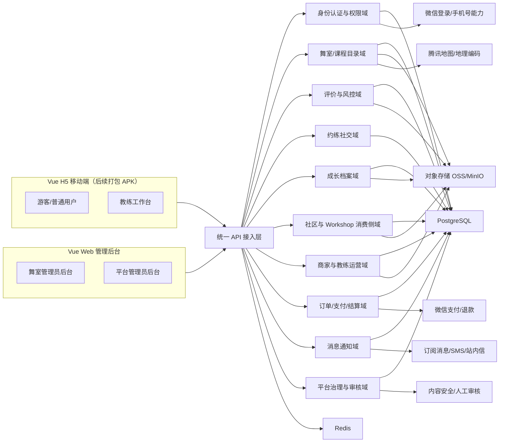

# BitDance 系统架构与 MVP 落地方案

## 修订记录

| 日期 | 修改人 | 修改条目 | 修改原因 |
| --- | --- | --- | --- |
| 2026-05-09 | 第五组 | 1.1、2.1、2.2、2.6、2.7、4.1-4.7、7.1-7.7 节将“用户/教练微信小程序”统一替换为“用户/教练 Vue H5 移动端”；新增统一前端基线说明；明确后续以 Capacitor 打包为 APK | 团队评审后决定用户端与教练端不再走微信小程序双轨开发，改为单一 Vue 3 + Vite + TS H5 移动端，先纯 H5 上线、后续打包 APK，降低双端维护成本。Web 管理端职责收敛为舞室/平台管理员后台 |

## 0. 文档说明

- 需求来源：`开题立项书-BitDance(2).tex` 第 `4.3-4.9` 节，对应 `M1-M7` 七个需求模块。
- 目标产出：在 **完全覆盖原文功能点** 的前提下，设计 `用户/教练 Vue H5 移动端 + 舞室/平台管理员 Web 后台 + Spring Boot 后端` 的系统架构、功能细化方案与 MVP 分期路线。
- 设计原则：`先跑通决策闭环，再增强留存，再扩展活动与商业化`。
- 前端形态约定：`用户端` 与 `教练端` 共用同一份 Vue 3 H5 工程（移动端比例、375 设计稿、最大宽度 480px 居中），通过路由分组与角色态切换区分游客 / 普通用户 / 教练三类前台角色；上线先以浏览器 H5 形式发布，后续使用 Capacitor 打包为 Android APK 分发，不再开发微信小程序。Web 管理端是独立的桌面端 Vue 工程，仅承载舞室管理员与平台管理员后台。

## 1. 架构结论

### 1.1 推荐方案

建议采用如下形态：

1. 一个 **Vue 3 H5 移动端工程**（用户/教练前台），承载 `游客 / 普通用户 / 教练` 三类前台角色，通过角色切换展示不同工作台。先以浏览器 H5 上线，后续以 Capacitor 打包为 APK，不再开发微信小程序。
2. 一个 **Vue Web 管理端**（独立工程），承载 `舞室管理员 / 平台管理员` 两类后台角色，通过 RBAC 和数据权限区分菜单与可见数据。
3. 一个 **Spring Boot 模块化单体后端**，在一个工程内按业务域拆分模块，而不是一开始就做微服务。
4. 一个 **统一数据底座**，以 `PostgreSQL + Redis + 对象存储 + 地图/支付/消息第三方能力` 作为 MVP 基础设施。
5. 一个 **事件驱动的模块协作机制**，在单体内通过领域事件、定时任务和消息补偿解耦 M1-M7，保证未来可平滑拆分。

### 1.2 为什么不建议一开始做微服务

- 七个模块强相关，身份、课程、评价、约练、成长、Workshop 之间存在大量联动。
- 项目首要目标是验证用户是否真的会用，而不是提前优化未来的大规模吞吐。
- MVP 需要快速迭代，模块化单体更容易保障事务一致性、调试效率和交付速度。
- 只要模块边界、事件和数据归属先设计清楚，后续可以按域逐步拆分为独立服务。

## 2. 总体系统架构

### 2.1 角色与终端分配

| 角色 | 使用终端 | 核心职责 |
| --- | --- | --- |
| 游客 | Vue H5 移动端（后续可打包 APK） | 浏览舞室、课程、老师、社区公开内容，不可评价/收藏/约练 |
| 普通用户 | Vue H5 移动端（后续可打包 APK） | 搜索筛选、收藏、试听预约、评价、约练、打卡、报名 Workshop |
| 教练 | Vue H5 移动端（后续可打包 APK） | 在普通用户能力上，增加个人主页、授课管理、Workshop 创建侧轻运营、签到核销、评价回复、个人数据查看 |
| 舞室管理员 | Vue Web 管理后台 | 舞室认领、门店信息、课表、教练关系、Workshop 创建侧、评价申诉、经营数据 |
| 平台管理员 | Vue Web 管理后台 | 商家审核、教练资质审核、评价风控、内容审核、举报处理、字典配置、平台治理 |

### 2.2 整体架构图



### 2.3 架构分层

| 层次 | 说明 |
| --- | --- |
| 接入层 | H5 移动端接口、Web 管理接口、文件上传接口、回调接口 |
| 应用层 | 用例编排、参数校验、权限校验、事务控制、DTO 装配 |
| 领域层 | M1-M7 核心业务规则、聚合根、领域事件、状态流转 |
| 基础设施层 | PostgreSQL、Redis、对象存储、地图、支付、消息、审核第三方适配器 |

### 2.4 后端业务模块划分

| 后端模块 | 对应需求模块 | 核心职责 |
| --- | --- | --- |
| `iam-auth` | M3 | 微信登录、手机号登录、角色切换、权限校验、数据权限 |
| `user-profile` | M3 | 个人资料、偏好、隐私、消息中心、账号安全 |
| `studio-catalog` | M1 | 舞室、课程、老师、标签、课表、收藏、试听预约、对比 |
| `review-center` | M2 | 结构化评价、维度分数、验证状态、权重、雷达图、申诉 |
| `review-risk` | M2 | 反刷评、异常识别、折叠、审核流 |
| `practice-social` | M4 | 约练发布、响应、匹配、搭子关系、约练评价、拼课 |
| `growth-archive` | M5 | 打卡、时间线、目标、作品、报告、徽章、收藏聚合 |
| `content-community` | M6 | 动态、评论、点赞、话题、关注、搜索 |
| `workshop-consumer` | M6 | Workshop 浏览、报名、订单、签到、提醒 |
| `merchant-ops` | M7 | 舞室入驻、门店管理、教练关系、课表创建侧、Workshop 创建侧 |
| `billing-settlement` | M7 | 收益统计、分账规则、提现、账单 |
| `governance-center` | M2/M3/M6/M7 | 内容审核、举报、商家审核、教练资质审核、违规处理 |
| `message-center` | M3/M4/M6/M7 | 站内信、模板消息、提醒、待办 |

### 2.5 模块协作原则

- `M3` 只负责“用户是谁、拥有哪些角色与权限”，不承载成长数据。
- `M5` 只负责“用户产生了哪些成长行为”，通过 `user_id` 单向引用 M3。
- `M6` 与 `M7` 通过 `workshop_id`、`session_id`、`order_id` 协作，消费侧只读公开快照，创建侧掌握源数据。
- `M2` 的评价权重不直接依赖页面来源，而依赖 `试听预约 / 订单支付 / 签到核销 / 履约完成` 等业务事实。
- `M4` 读取 M3 的偏好标签与 M1 的舞室/课程/地点信息，但不修改这两个域的主数据。

### 2.6 技术栈与工程落地约束

### 技术栈基线

| 层次 | 技术选型 | 说明 |
| --- | --- | --- |
| 用户/教练前端 | Vue 3 + Vite + TypeScript + Pinia + Vue Router (hash) + Vant 4 | 移动端 H5（375 设计稿、最大宽度 480px 居中、postcss-px-to-viewport），承载游客、普通用户、教练三类前台角色；先以浏览器 H5 形式上线，后续使用 Capacitor 打包为 Android APK 分发，不开发微信小程序。 |
| 管理端前端 | Vue 3 + Vite + TypeScript + Element Plus（建议） | 独立工程，承载舞室管理员与平台管理员 Web 后台，配合 RBAC 和数据权限展示不同菜单与数据；不与 H5 移动端共用工程。 |
| 后端 | Spring Boot + Java 21 | 采用模块化单体工程，按业务域分包组织 M1-M7 能力。 |
| 数据库 | PostgreSQL | 作为权威业务数据源，承载账号、舞室、课程、评价、约练、成长、Workshop、结算等核心数据。 |

在吸收简易实现方案时，技术栈以本文件为准，不切换到独立 APP、Node.js、MySQL、MongoDB 或微服务。兼容的工程细节按如下方式落地：

| 类别 | 落地约束 |
| --- | --- |
| 后端工程 | Spring Boot 模块化单体，按 `iam-auth`、`studio-catalog`、`review-center` 等业务包隔离；跨模块只通过应用服务接口、领域事件和只读快照协作，不跨包直接调用 DAO。 |
| API 规范 | 对 H5 移动端和 Web 管理端统一输出 `{ code, message, data, traceId }`；列表接口统一支持 `page`、`pageSize`、`sort`；地理接口统一支持 `latitude`、`longitude`、`distanceKm`。 |
| 接口文档 | 使用 SpringDoc OpenAPI 维护接口契约，阶段 A 开始即与前端 Mock、联调和回归测试绑定。 |
| 数据迁移 | PostgreSQL DDL 通过版本化迁移脚本管理，种子数据导入、字典初始化和后续结构调整必须可重复执行。 |
| 缓存策略 | Redis 承载验证码、刷新令牌、热点舞室详情、评价聚合摘要、约练广场列表、限流计数和幂等短期结果。 |
| 定时任务 | 先使用 Spring Scheduler 完成约练过期关闭、评价聚合缓存刷新、Workshop 报名截止、成长统计日聚合；后续任务量增加再接独立调度平台。 |
| 前端协作 | H5 移动端作为用户/教练前台主入口（路由保持 hash 模式以兼容后续 Capacitor 打包），Web 管理端面向商家和平台；两端共用统一 API 与登录基座，但工程独立。 |
| APK 打包 | 用户/教练 H5 在阶段 B 收尾后使用 Capacitor 打包 Android APK，路由必须维持 hash 模式，禁止使用 history 模式或依赖宿主域名的硬编码路径。 |
| 发布控制 | 阶段 C/D 的社区、推荐、支付、结算等增强能力建议加 Feature Flag，避免半成品影响阶段 B 主闭环。 |

### 2.7 后端代码规范落地约束

后端代码规范以当前架构和数据库设计为准，简易实现方案中的通用工程规范可以吸收，但必须修正为与 BitDance 领域模型一致。

### 后端包结构建议

后端采用 `Spring Boot + Java 21` 模块化单体，代码包名按业务域组织。工程实现中可使用更短的 Java 包名，但必须能映射回第 2.4 节的业务模块。

```text
src/main/java/com/bitdance
  ├── BitDanceApplication.java
  ├── common                  # 统一响应、异常、校验、审计、工具类
  ├── iam                     # 对应 iam-auth，登录、Token、角色权限、数据权限
  ├── profile                 # 对应 user-profile，资料、偏好、隐私、设备、安全
  ├── catalog                 # 对应 studio-catalog，舞室、课程、教练、课表、收藏、试听
  ├── review                  # 对应 review-center / review-risk，评价、维度、权重、风控、申诉
  ├── practice                # 对应 practice-social，约练、响应、搭子、拼课意向
  ├── growth                  # 对应 growth-archive，打卡、作品、目标、徽章、时间线
  ├── content                 # 对应 content-community，动态、评论、话题、关注
  ├── workshop                # 对应 workshop-consumer，活动浏览、订单、签到、日历
  ├── merchant                # 对应 merchant-ops，舞室入驻、课程创建侧、教练关系
  ├── settlement              # 对应 billing-settlement，分账、账单、提现
  ├── governance              # 对应 governance-center，审核、举报、处罚
  └── message                 # 对应 message-center，站内信、订阅消息、提醒
```

各业务包内建议继续按 `controller / service / repository / domain / dto` 分层。`Controller` 只处理 HTTP 入参、鉴权上下文和响应包装；`Service` 承担事务、权限判断、状态流转和跨表编排；`Repository` 只负责数据访问，不写业务状态判断。

### API 分区与响应规范

接口按端侧和权限域分区，避免 H5 移动端、商家后台、平台后台混用同一组路径。

| 路径前缀 | 使用方 | 说明 |
| --- | --- | --- |
| `/api/public/**` | 游客、H5 移动端公开页 | 不需要登录的城市、舞室公开详情、公开课程等接口。 |
| `/api/h5/**` | Vue H5 移动端（含未来 APK 包） | 普通用户和教练端接口，必须从 Token 中解析当前用户身份。原 `/api/mp/**` 路径迁移至此；保留期内可双写以兼容。 |
| `/api/merchant/**` | 舞室管理员 Web | 必须校验舞室管理员角色与舞室数据权限。 |
| `/api/admin/**` | 平台管理员 Web | 必须校验平台角色、菜单权限和操作权限。 |
| `/api/callback/**` | 第三方回调 | 微信登录、支付、消息等回调，必须校验签名和幂等。 |

所有接口统一返回：

```json
{
  "code": "SUCCESS",
  "message": "success",
  "data": {},
  "traceId": "202605061530001234"
}
```

列表接口统一使用 `page`、`pageSize`、`sort`，其中 `page` 从 1 开始，`pageSize` 默认 20，最大不超过 100，排序字段必须在白名单内。

### 命名与枚举对齐规则

- 教练统一命名为 `coach`，不使用 `teacher`；相关字段为 `coach_id`，Java 枚举为 `COACH`。
- 账号主表统一为 `app_user`，Java 领域可命名为 `AppUser`，避免与数据库关键字或通用 `User` 概念混淆。
- 多态目标统一使用 `target_type + target_id`，目标值必须与数据库约束一致，例如评价对象为 `studio / course / coach`。
- 收藏对象与数据库保持一致，支持 `studio / course / coach / workshop / content_post`。
- 经纬度精度与当前 schema 保持一致，使用 `numeric(10, 6)`；如后续引入 PostGIS，再做统一迁移。
- 不全局新增 `deleted` 逻辑删除字段。核心业务表通过 `status`、`review_status`、`post_status`、`publish_status` 等业务状态表达隐藏、下架、取消或删除。

关键状态枚举必须与 PostgreSQL 约束一致。例如 `practice_post.post_status` 对应：

```java
public enum PracticePostStatus {
    DRAFT,
    PUBLISHED,
    MATCHED,
    CONFIRMED,
    COMPLETED,
    CANCELED,
    EXPIRED
}
```

评价目标类型对应：

```java
public enum ReviewTargetType {
    STUDIO,
    COURSE,
    COACH
}
```

### 数据权限与安全规则

- 所有非公开接口必须鉴权，前端传入的 `userId` 不可信，必须以后端 Token 解析结果为准。
- 普通用户只能访问自己的收藏、预约、约练申请、打卡、成长目标和消息。
- 教练只能访问自己的教练主页、课程关系、评价、Workshop 创建侧数据，以及被授权的舞室数据。
- 舞室管理员只能访问已认领或被授权的舞室、课程、排期、教练关系、试听预约和经营数据。
- 平台管理员按 RBAC 和数据权限访问审核、举报、字典、风控和平台治理数据。
- 文件上传必须校验类型、大小、扩展名、业务用途和审核状态，不允许直接信任前端传入的文件 URL。

### 事务、幂等与并发规则

以下场景必须显式使用事务：

- 商家认领审核通过并绑定管理员权限。
- 创建课程排期并更新公开快照或缓存。
- 创建评价并写入维度分、附件和风控记录。
- 发布约练并初始化参与人数。
- 确认约练申请并更新人数、状态和通知。
- Workshop 下单、支付回调、退款、签到和结算。

以下场景必须使用唯一约束、Redis 幂等键或 `idempotency_token` 做重复提交保护：

- 微信支付回调、退款回调。
- 用户重复报名 Workshop。
- 用户对同一来源重复评价。
- 约练重复申请加入。
- 试听预约重复提交。

### 媒体与附件规则

图片、视频、文档等文件统一先写入 `media_asset`，再通过 `media_attachment` 与业务对象建立关系。业务表只保留封面、头像等少量强关联字段，例如 `cover_asset_id`、`avatar_asset_id`，不在评价、动态、作品等表中散落保存多个文件 URL。

### Redis 与定时任务规则

Redis key 按业务域命名，并设置明确过期时间：

| 场景 | Key 示例 |
| --- | --- |
| 验证码 | `auth:sms:{phone}` |
| 登录刷新令牌 | `auth:refresh:{userId}:{deviceId}` |
| 舞室热点详情 | `catalog:studio:detail:{studioId}` |
| 评价摘要 | `review:summary:{targetType}:{targetId}` |
| 约练广场 | `practice:square:{cityId}:{danceStyleId}` |
| 幂等结果 | `idem:{bizType}:{bizKey}` |

定时任务先使用 Spring Scheduler 承载，任务逻辑必须可重入、可幂等、可记录执行结果。阶段 B 至少保留约练过期关闭、评价聚合缓存刷新、成长统计日聚合；阶段 C 增加 Workshop 报名截止处理和订单状态补偿。

## 3. 关键数据模型与状态流

### 3.1 关键实体

| 实体 | 说明 |
| --- | --- |
| `app_user` | 账号基础信息 |
| `user_role_binding` | 用户与普通用户/教练/舞室管理员/平台管理员的绑定关系 |
| `user_profile` | 昵称、头像、简介、生日、舞蹈偏好等 |
| `privacy_setting` | 资料、打卡、约练、社区动态可见性 |
| `studio` | 舞室主档 |
| `studio_claim` | 舞室认领与审核记录 |
| `coach` | 教练主档与资质信息 |
| `studio_coach_relation` | 全职/签约/自由教练关系及权限边界 |
| `course` / `course_schedule` | 课程与排期 |
| `trial_booking` | 试听预约 |
| `favorite` | 收藏关系 |
| `review` / `review_dimension_score` | 评价主记录与维度分 |
| `review_appeal` | 商家申诉单 |
| `practice_post` | 约练发布信息 |
| `practice_join_request` | 约练响应与确认 |
| `buddy_relation` | 搭子关系 |
| `practice_rating` | 约练后双向评价 |
| `growth_checkin` | 打卡记录 |
| `growth_work` | 阶段作品 |
| `growth_goal` | 周/月训练目标 |
| `growth_badge` | 成就徽章 |
| `content_post` / `content_comment` | 社区动态与评论 |
| `topic_tag` | 话题标签 |
| `follow_relation` | 关注关系 |
| `workshop` / `workshop_session` | Workshop 主档与场次 |
| `workshop_order` | Workshop 订单 |
| `workshop_checkin` | 签到核销记录 |
| `payment_record` / `refund_record` | 支付流水与退款流水 |
| `settlement_bill` | 结算单 |
| `notification` | 站内消息与提醒 |
| `report_ticket` | 举报工单 |
| `user_block_relation` | 用户拉黑关系 |
| `audit_log` | 审核与治理日志 |
| `idempotency_token` | 写接口幂等控制记录 |
| `data_import_batch` | 平台种子数据与批量导入批次 |
| `behavior_event_log` | 用户行为埋点与 MVP 指标统计 |

### 3.2 关键状态流

1. `舞室认领`：待提交 -> 待审核 -> 通过 / 驳回 -> 开通后台。
2. `试听预约`：待提交 -> 待确认 -> 已确认 / 已拒绝 -> 已到店 / 已失约。
3. `Workshop 订单`：待支付 -> 已支付 -> 已取消 / 已退款 / 已签到 / 已完成。
4. `约练帖`：草稿 -> 已发布 -> 已有人响应 -> 已确认 -> 已完成 / 已取消 / 已过期。
5. `评价`：待发布 -> 已发布 -> 风控标记 / 折叠 -> 申诉处理中 -> 审核结论。
6. `教练关系`：待邀请 -> 已绑定 -> 生效中 -> 变更中 -> 已结束。

### 3.3 关键领域事件

- `UserRegistered`
- `StudioClaimApproved`
- `CoursePublished`
- `TrialBookingConfirmed`
- `PracticePostMatched`
- `PracticeCompleted`
- `GrowthCheckinCreated`
- `WorkshopPublished`
- `WorkshopOrderPaid`
- `WorkshopCheckedIn`
- `ReviewSubmitted`
- `ReviewAppealCreated`

这些事件用于解耦通知、统计、风控、推荐等旁路能力。

## 4. 七大模块功能细化与端侧落位

### 4.1 M1 舞室与课程模块

### 模块目标

围绕“找舞室、选课程、看老师、做决策”建立消费前链路，是 MVP 最核心的入口模块。

### 用户/教练 H5 端

- 首页定位授权、城市切换、学校/商圈快捷切换。
- 附近舞室列表与地图双视图切换。
- 搜索框联想：舞室名、舞种、老师名、商圈名。
- 多维筛选：舞种、价格、距离、时段、难度、适合人群、是否零基础友好。
- 舞室详情：基础信息、营业时间、导航、环境照片、主打舞种、用户纠错入口。
- 课程详情：课程名、舞种、难度、价格、训练强度、上课时长、上课频次。
- 老师详情：擅长舞种、教学风格、评价摘要、可上课程、可约时间。
- 收藏舞室/课程/老师。
- 周课表与按天查看。
- 试听预约、预约状态查看、取消、提醒。
- 舞室对比：收藏列表中选取 2-3 家进行对比。
- 教练在小程序内可预览自己的公开页与课程展示效果。

### 舞室管理员 Web

- 舞室基础信息维护：门店名称、地址、介绍、环境图、营业时间。
- 课程目录与排期管理：课程新增、编辑、上下架、老师/场地绑定。
- 老师公开资料维护入口。
- 试听预约处理：确认、拒绝、备注、到店标记。
- 用户纠错处理：确认采纳或提交平台审核。

### 平台管理员 Web

- 城市、商圈、舞种、难度、适合人群等字典维护。
- 平台预置舞室数据导入与校验。
- 舞室认领后主数据合并。
- 搜索推荐位与基础排序规则配置。

### 后端能力

- `GeoSearchService`：附近搜索、距离排序、商圈聚类。
- `StudioCatalogService`：舞室、课程、老师详情聚合。
- `CourseScheduleService`：按日/周排期读取。
- `FavoriteService`：收藏关系。
- `TrialBookingService`：试听预约流转。
- `StudioCompareService`：多舞室对比。
- `CatalogCorrectionService`：用户纠错与主数据修订。

### 关键补充设计

- 数据来源必须保留 `平台录入 / 商家认领 / 用户纠错` 三层来源标记。
- 搜索能力 MVP 先用 `PostgreSQL + 地图 API + Redis 热缓存`，后续如搜索复杂度提升再接 `Elasticsearch`。
- 附近搜索采用“城市/商圈 + `geo_hash` 或经纬度边界框粗筛 + `fn_haversine_km` 精排”的两段式查询，`geo_hash` 由应用层在地址地理编码成功后写入，避免全表距离计算。
- 舞室种子数据通过批量导入批次留痕，至少记录来源、导入人、原始文件、成功/失败条数和错误摘要。
- 课程与老师对外展示使用“公开快照”，避免后台频繁编辑影响前台一致性。
- 热门舞室详情、搜索筛选结果和评价摘要可进入 Redis 短期缓存，后台信息变更、评价新增和课程上下架时按目标对象失效。

### 4.2 M2 评价系统模块

### 模块目标

建立舞蹈场景专属的结构化评价体系，让用户能判断“适不适合自己”，同时可控地解决刷评与纠纷问题。

### 用户/教练 H5 端

- 对舞室、老师、课程分别发起评价。
- 结构化评分表单：每个对象对应不同维度。
- 文本评价、图片上传、短视频上传。
- 已验证标签展示：试听、报名、签到、核销等来源。
- 评价列表排序：最新、最有帮助、已验证优先。
- 雷达图和维度均分展示。
- 用户编辑/删除自己评价。
- 约练完成后的双向约练评价入口。

### 教练 H5 端

- 查看个人教学评价趋势。
- 回复针对自己的评价。
- 对恶意评价发起申诉。

### 舞室管理员 Web

- 舞室维度、老师维度、课程维度评价查看。
- 评价回复、置顶精选评价。
- 不实评价申诉与证据上传。
- 异常评分波动提醒。

### 平台管理员 Web

- 评价审核台：可疑评价、重复评价、同设备异常评价。
- 权重规则配置：已支付、已签到、已核销、仅注册。
- 申诉处理工作台。
- 敏感词、违规内容审核。

### 后端能力

- `ReviewWriteService`：评价创建、编辑、删除。
- `ReviewDimensionService`：结构化维度模板、维度分计算。
- `ReviewWeightService`：验证状态和权重计算。
- `ReviewRiskService`：相似文案、集中时段刷评、低龄账号、设备指纹异常识别。
- `ReviewReadService`：列表、统计、雷达图、摘要。
- `ReviewAppealService`：申诉流转。

### 关键补充设计

- 评价与订单/试听/签到等事实表建立弱关联，只保存校验结果，不跨域复制主数据。
- 评价提交时即计算 `is_verified`、`verified_source_type`、`weight_factor` 和初始 `risk_level`，前台展示不再临时推导权重。
- 评分聚合以 `vw_review_target_summary` 为基础读模型，Redis 缓存目标对象摘要；定时任务约每 10 分钟刷新热点对象，新增评价或申诉结论可触发局部失效。
- 风控建议采用“降权 + 折叠 + 待审”三层策略，而不是简单删评。
- 风控输入至少包含账号年龄、手机号/微信绑定状态、登录设备、IP、相似文本、短时集中发布、已验证业务事实和历史举报记录。
- 评价对象模型要统一为 `target_type + target_id`，便于复用。

### 4.3 M3 用户账号与角色模块

### 模块目标

作为统一身份基座，解决“谁能看什么、谁能做什么、谁能管理哪些数据”。

### 用户/教练 H5 端

- 微信授权登录。
- 手机号快捷绑定与验证码登录。
- 个人资料编辑：昵称、头像、性别、生日、简介。
- 舞蹈偏好设置：舞种、当前水平、学习目标。
- 角色切换：普通用户 / 教练。
- 隐私设置：资料、打卡、约练、动态独立配置。
- 消息中心：系统消息、约练提醒、评价提醒、报名提醒。
- 账号安全：登录设备、绑定手机号、异常提醒。
- 举报入口与拉黑能力。
- 社交账号展示位。

### 舞室管理员 Web

- 后台账号登录。
- 子账号创建与权限分配。
- 舞室数据权限控制：只能看自己名下舞室与教练。

### 平台管理员 Web

- 管理员账号、角色、菜单、按钮权限。
- 审核员、运营、客服等岗位权限拆分。
- 用户封禁、角色升级审批、异常账号冻结。

### 后端能力

- `WechatAuthService`：保留以便未来对接微信开放平台 H5 登录或 APK 内嵌微信 SDK；MVP 阶段以手机号验证码登录为主，可暂不实现。
- `AccountService`：手机号登录、验证码、绑定、解绑。
- `RolePermissionService`：RBAC 与数据权限。
- `UserProfileService`：资料和偏好。
- `PrivacyService`：可见性控制。
- `MessageInboxService`：站内消息中心。
- `SecurityService`：登录风控、设备管理、异常提醒。
- `ReportService`：举报与账号处置。

### 关键补充设计

- 同一账号可同时绑定多个角色，但不同角色看到的菜单和数据范围必须隔离。
- 教练角色的来源必须经过 `舞室邀请绑定` 或 `独立教练审核通过`。
- 平台管理员与舞室管理员必须使用不同的数据权限域，防止越权。
- 登录态采用短期 JWT + Redis 刷新令牌，验证码、刷新令牌、异常登录临时标记均设置过期时间。
- 手机验证码必须做手机号、设备和 IP 三层限频；开发环境可使用固定验证码或日志验证码，但不能进入生产配置。
- 拉黑关系独立于关注和搭子关系，拉黑后限制私信、约练邀请、评论提醒等直接触达能力。

### 4.4 M4 约练社交模块

### 模块目标

把“找搭子”“约练”“练完继续联系”从微信群中抽离出来，做成与舞种、水平、地点强关联的学习场景社交。

### 用户/教练 H5 端

- 发布约练：舞种、时间、地点、人数、水平要求、备注。
- 约练广场：附近、同城、按舞种/时间/水平筛选。
- 响应约练：申请加入、撤回申请、发起者确认。
- 系统推荐潜在搭子。
- 约练详情页：发起人信息、已报名人数、状态、提醒。
- 约练完成后互评：守时、友好、水平匹配。
- 互加搭子、查看搭子列表、再次邀约。
- 拼课发起：达成人数阈值后通知舞室。

### 教练 H5 端

- 教练可发起公开约练或主题练习局，带动学员复训。
- 教练可查看自己发起活动的报名与到场情况。

### 平台管理员 Web

- 违规约练内容审核。
- 频繁爽约、恶意骚扰、垃圾发布账号治理。
- 热门约练城市、舞种、时段的运营分析。

### 后端能力

- `PracticePostService`：约练帖 CRUD、到期关闭。
- `PracticeMatchService`：基于偏好、距离、历史活跃度的匹配。
- `PracticeJoinService`：报名、确认、取消、满员控制。
- `BuddyService`：搭子关系沉淀。
- `PracticeRatingService`：约练后互评。
- `GroupClassIntentService`：拼课意向收集与通知。
- `PracticeRuleEngine`：取消次数、爽约惩罚、发帖上限。

### 关键补充设计

- 约练状态必须支持自动过期与提醒。
- 约练广场可用 Redis ZSet 按发布时间或开始时间维护热点列表，PostgreSQL 仍作为权威数据源。
- MVP 匹配规则先采用 `舞种相同 + 水平相差不超过一档 + 距离阈值内 + 非拉黑关系` 的规则引擎，高级个性化推荐留到阶段 C/D。
- 约练地点在公开列表默认展示到商圈/舞室级别，双方确认后再展示更精确的集合位置或联系方式。
- 约练规则中要保留 `取消时限` 和 `爽约惩罚`，这是冷启动阶段维持信任感的关键。
- 搭子关系不能是单向关注，必须基于一次完成的协作事件沉淀。

### 4.5 M5 成长档案模块

### 模块目标

沉淀“用户学了多久、练了多少、有哪些成果”，把短期课程消费转化为长期成长关系。

### 用户/教练 H5 端

- 训练打卡：舞种、时长、地点、感受、是否公开。
- 学习数据统计：累计时长、课程数、舞种数、连续打卡天数。
- 收藏管理：舞室、课程、老师、Workshop 的统一收藏夹。
- 成长时间线：试听、上课、约练、打卡、作品、Workshop 参与。
- 阶段作品上传：图片/视频。
- 训练目标设置：每周/每月训练次数或时长。
- 成长报告：月报/季报。
- 成就徽章：连续打卡、首次公开作品、完成一定课时等。

### 教练 H5 端

- 教练可查看自身训练与授课双维度成长数据。
- 教练可把公开作品挂到个人主页。

### 后端能力

- `GrowthCheckinService`：打卡与可见性。
- `GrowthStatsService`：统计指标计算。
- `GrowthTimelineService`：时间线聚合。
- `GrowthGoalService`：目标追踪。
- `GrowthWorkService`：阶段作品。
- `GrowthReportService`：报告生成。
- `BadgeService`：徽章规则。
- `FavoriteAggregateService`：收藏聚合视图。

### 关键补充设计

- M5 必须与 M3 解耦，不能把资料属性直接写进成长记录表。
- 时间线建议聚合来自 `试听、课程、Workshop、打卡、约练、作品` 的事件流。
- 成长统计除累计时长、课程数、舞种数外，还应保留连续打卡天数、最近训练时间、阶段目标进度等可直接驱动页面展示的指标。
- 收藏聚合只读取 `favorite` 多态关系和目标对象公开快照，不反向修改 M1/M6/M7 的业务主表。
- 报告和徽章是典型增强项，不能抢占 MVP 资源。

### 4.6 M6 社区与活动模块（消费侧）

### 模块目标

承载内容传播和 Workshop 消费闭环，但必须始终服务于舞蹈学习主线，而不是做泛娱乐社区。

### 用户/教练 H5 端

- 动态发布：图文/视频、定位、舞种标签、话题标签。
- 互动：点赞、评论、回复、转发、收藏、举报。
- 话题聚合页：试听感受、课堂记录、约练日常等。
- 关注与粉丝：关注后优先看到内容。
- 内容搜索：话题、舞种、用户、活动。
- Workshop 浏览：列表、筛选、详情、师资、场地、往期评价、剩余名额。
- Workshop 报名支付：选场次、下单、支付、取消、退款进度。
- 扫码签到：活动当天核销。
- 活动日历：我的报名、提醒、开场通知。

### 教练 H5 端

- 教练可发布与自己课程/Workshop 关联的内容。
- 教练可查看自己发布活动的报名情况与签到情况。

### 平台管理员 Web

- 内容审核、举报处理、话题运营。
- Workshop 推荐位和活动页运营。
- 退款争议处理与活动异常兜底。

### 后端能力

- `ContentPostService`：动态、编辑、删除。
- `ContentInteractionService`：点赞、评论、收藏、举报。
- `TopicService`：话题聚合和推荐。
- `FollowService`：关注关系。
- `ContentSearchService`：按话题/舞种/用户/活动检索。
- `WorkshopBrowseService`：公开活动快照查询。
- `WorkshopOrderService`：下单、支付、取消、退款。
- `WorkshopCheckinService`：签到码、核销记录。
- `ActivityCalendarService`：日历与提醒。

### 关键补充设计

- M6 只负责消费侧和互动侧，不负责活动源数据编辑。
- Workshop 详情页展示使用 M7 输出的活动公开快照，避免跨域强耦合。
- Workshop 报名写入订单前必须校验场次容量、报名截止时间、用户幂等 token 和活动发布状态。
- 支付采用适配器隔离：生产对接微信支付与退款回调，联调/演示环境允许使用模拟支付适配器跑通订单状态机。
- 扫码签到使用一次性或短期有效的签到码，核销结果写入 `workshop_checkin`，并通过领域事件触发评价邀请和履约统计。
- 社区推荐规则要优先“与学习相关”而不是纯热度。

### 4.7 M7 商家与教练管理模块（创建侧）

### 模块目标

为舞室和教练提供供给侧运营能力，既支撑前台 M1/M6 的信息展示，也为后续商业化和结算打基础。

### 教练 H5 端

- 教练身份申请与进度查看。
- 个人教学主页编辑：简介、教学风格、代表作品、可约时段。
- 我的课程：查看自己关联课程与场次。
- 发布/申请发布 Workshop：按身份类型走直发或审批流。
- 订单签到核销：扫码签到、名单查看、异常到场处理。
- 评价查看与回复。
- 个人数据：授课次数、核销率、用户评分。
- 个人收益查看：签约分成或自由教练收益。

### 舞室管理员 Web

- 舞室入驻认领、资质提交、审核进度查看。
- 门店基础信息维护。
- 课表与课程管理。
- 教练账号邀请绑定、身份变更、合作关系维护。
- Workshop 创建、场次、价格、人数、报名截止时间配置。
- 报名与履约：订单、退款、签到、活动复盘。
- 评价回复与申诉。
- 经营数据看板：试听转化、核销率、课程热度、复购。
- 收益结算、账单导出、提现申请。

### 平台管理员 Web

- 商家资质审核。
- 独立教练资质审核。
- 舞室与教练关系纠纷处理。
- Workshop 合规审核。
- 分账规则、抽佣规则、账单复核。
- 商家违规处罚和黑名单。

### 后端能力

- `MerchantOnboardingService`：舞室认领与资质审核。
- `CoachCertificationService`：教练审核、关系绑定。
- `StudioOpsService`：门店与品牌信息维护。
- `CourseOpsService`：供给侧课程与排期。
- `WorkshopCreateService`：活动创建、审批、发布。
- `FulfillmentService`：签到核销、退款、履约统计。
- `MerchantReviewReplyService`：评价回复与申诉。
- `MerchantDashboardService`：经营统计。
- `SettlementService`：分账、账单、提现。

### 关键补充设计

- `studio_coach_relation` 必须明确 `全职 / 签约 / 自由` 三类关系，并带有效期与收益规则。
- 教练发布 Workshop 的权限必须与关系类型挂钩，不能只靠前端按钮显隐。
- M7 的数据要输出两类视图：`后台经营视图` 与 `前台公开快照`。
- 舞室、课程、教练和 Workshop 的后台批量导入需使用统一模板和导入批次记录，错误行可追溯、可重试。
- 经营看板 MVP 先覆盖试听转化率、课表维护活跃度、报名/核销数、评价均分和退款异常数，收益结算指标留到阶段 D 深化。

## 5. MVP 分期实现方案

### 5.1 分期原则

1. 第一优先级验证“用户是否愿意在平台上做决策”。
2. 第二优先级验证“约练与成长记录能否延长留存”。
3. Workshop、社区、商家经营与结算必须建立在前两个假设成立之后。
4. 每一阶段都只做本阶段最小可验证闭环，避免用后台复杂度拖垮前台体验验证。

### 5.2 阶段划分

| 阶段 | 目标 | 核心交付 |
| --- | --- | --- |
| 阶段 A：架构底座 | 搭好账号、角色、主数据、文件、审核、消息基建 | 登录、RBAC、字典、舞室主数据、文件上传、日志、基础通知 |
| 阶段 B：MVP 闭环 | 跑通“搜索决策 -> 试听收藏 -> 评价 -> 约练 -> 打卡” | M1 核心、M2 核心、M3 核心、M4 基础、M5 基础、M7 最小供给侧 |
| 阶段 C：增长验证 | 引入 Workshop 与内容传播，验证增长与活动履约 | M6 主要能力、M7 活动创建侧、M4 推荐/搭子、M5 作品/目标 |
| 阶段 D：商业化与精细运营 | 做推荐、结算、报告、徽章、申诉、数据看板深化 | 智能推荐、拼课、成长报告、徽章、收益结算、精细运营 |

### 5.3 各阶段详细范围

### 阶段 A：架构底座

必须完成：

- 微信登录、手机号绑定、后台登录。
- 角色模型、RBAC、数据权限。
- 城市/商圈/舞种/难度字典。
- 舞室、老师、课程主数据基础表。
- 文件上传、图片/视频对象存储。
- 审核日志、操作日志、通知中心底座。

这一阶段不追求用户可感知功能丰富，只为阶段 B 的快速实现打地基。

### 阶段 B：MVP 闭环

必须完成：

- `M1`：附近搜索、筛选、舞室/课程/老师详情、收藏、课表、试听预约。
- `M2`：舞室/老师/课程评价、验证标签、基本风控。
- `M3`：登录、资料、偏好、角色切换、消息中心。
- `M4`：约练发布、广场、响应、确认、过期关闭。
- `M5`：训练打卡、统计、收藏聚合、成长时间线。
- `M7`：舞室认领、基础信息维护、课程排期、教练绑定，保证供给侧可运营。

明确不做或只做极简版：

- 不做完整社区 feed。
- 不做 Workshop 支付闭环。
- 不做拼课。
- 不做成长报告与徽章。
- 不做复杂分账结算。
- 不做高级推荐算法。

这是一版可以真正上线试点的最小产品。

### 阶段 C：增长验证

必须完成：

- `M6`：动态内容、互动、Workshop 浏览/报名/支付/签到/日历。
- `M7`：Workshop 创建侧、报名履约、评价申诉、基础数据看板。
- `M4`：匹配推荐、搭子沉淀、约练评价。
- `M5`：阶段作品、训练目标。
- `M2`：图文/视频评价、商家申诉。

这一阶段的目标不是把平台做大，而是验证“活动与内容是否带来新增和复访”。

### 阶段 D：商业化与精细运营

必须完成：

- `M1` 智能推荐。
- `M4` 拼课。
- `M5` 成长报告、徽章。
- `M6` 话题运营、复杂搜索排序、关注流增强。
- `M7` 收益结算、抽佣、提现、深度经营分析。
- 平台治理细化：更成熟的风控、申诉、推荐位和活动位运营。

### 5.4 MVP 成功指标建议

| 指标 | 建议观察口径 |
| --- | --- |
| 搜索转详情率 | 进入首页搜索后查看详情的比例 |
| 收藏/试听转化率 | 查看舞室或课程后完成收藏或试听预约的比例 |
| 评价提交率 | 有试听/上课事实的用户中完成评价的比例 |
| 约练响应率 | 发布约练后 48 小时内收到有效响应的比例 |
| 7 日留存 | 完成首次收藏/评价/约练/打卡后的 7 日回访率 |
| 供给侧活跃度 | 已认领舞室中持续维护课表的比例 |

### 5.5 五周开发执行节奏

如果项目需要按实训或试点节奏快速落地，可在阶段 A/B 的大框架下采用五周执行计划。该计划不改变前述阶段划分，只把阶段 A 与阶段 B 拆成更细的周交付。

| 周次 | 重点 | 交付与验收 |
| --- | --- | --- |
| W1：工程底座与 M3 | 仓库规范、Spring Boot 工程骨架、PostgreSQL 迁移、Redis、OpenAPI、统一响应、JWT、微信/手机号登录、角色权限 | 登录后可拿到 token；鉴权接口可访问；OpenAPI 可查看；核心表和字典初始化完成。 |
| W2：M1 舞室课程主干 | 舞室种子数据导入、附近搜索、筛选、详情、课程/老师详情、收藏、课表基础 | 用户可完成“定位 -> 筛选 -> 查看详情 -> 收藏”主链路；平台可导入或维护试点舞室数据。 |
| W3：M2 评价与 M4 约练 | 结构化评价、验证权重、评价聚合缓存、约练发布、广场、响应确认、过期关闭 | 用户可看到评分摘要并提交评价；可发布约练、响应约练并进入确认状态。 |
| W4：M5 成长与活动预留 | 训练打卡、成长统计、收藏聚合、成长时间线；为 Workshop 浏览、订单和签到准备接口骨架 | 用户可记录训练并查看累计数据；活动交易能力具备联调入口但不抢占阶段 B 主闭环。 |
| W5：M7 最小供给侧与收尾 | 舞室认领、基础信息维护、课表维护、教练绑定、后台审核、回归测试、部署文档 | 试点舞室可维护基础信息和课表；用户端主链路无阻塞缺陷；部署与运营手册可交付。 |

执行约束：

- 每周一先冻结本周 OpenAPI 字段，前端可用 Mock 并行开发，周中集中联调。
- 舞室、课程、教练、Workshop 种子数据从 W1 开始准备，导入失败必须能定位到行号和字段。
- 每周保留半天用于缺陷修复、接口对齐和文档更新，不插入新范围。
- 阶段 C/D 的功能可以保留代码骨架或 Feature Flag，但默认不影响阶段 B 验收。

## 6. 非功能与治理要求

| 维度 | 要求 |
| --- | --- |
| 安全 | 登录态隔离、RBAC、数据权限、验证码限频、关键操作审计、支付回调验签 |
| 性能 | 附近搜索和详情页优先优化，搜索结果、评价摘要、约练广场建议做缓存与分页 |
| 一致性 | 订单、退款、签到、预约、评价提交等写操作必须支持幂等 |
| 可运维性 | 关键业务链路埋点、traceId、错误告警、操作日志、审核日志 |
| 合规 | 用户授权定位、手机号、内容上传时需有明确告知与同意 |
| 可扩展 | 所有业务域先按模块分包，保留事件机制，为后续拆服务做准备 |

### 6.1 接口与权限规范

- 所有接口响应统一为 `{ code, message, data, traceId }`，异常响应也必须携带 `traceId`。
- 写接口统一校验登录态、角色权限、数据权限、幂等 token 和频率限制。
- H5 移动端和 Web 管理端共享认证基座，但按 `role_scope` 与数据权限输出不同菜单和可见数据。
- 支付回调、退款回调、对象存储回调等外部入口必须验签、记录原始请求摘要，并支持重复回调安全处理。

### 6.2 缓存、任务与搜索规范

- Redis key 需要按业务域命名，例如 `catalog:studio:detail:{studioId}`、`review:summary:{targetType}:{targetId}`、`practice:square:{cityId}:{danceStyleId}`。
- 缓存只保存可重建的读模型，不作为订单、签到、评价等强一致状态的唯一来源。
- 定时任务需要有可观测日志，至少记录任务名、开始时间、结束时间、处理条数和失败摘要。
- 附近搜索在 PostgreSQL 内先做城市、商圈、`geo_hash` 或边界框粗筛，再调用距离函数精排；超过单库检索能力后再迁移到 Elasticsearch。

### 6.3 埋点与运营指标

- 用户端关键行为写入 `behavior_event_log` 或等价埋点通道，覆盖搜索、筛选、详情浏览、收藏、试听、评价、约练、打卡、Workshop 报名。
- 管理端关键行为进入 `audit_log`，覆盖认领审核、课程上下架、教练关系变更、评价申诉、退款处理和结算操作。
- MVP 指标按日聚合，优先支撑搜索转详情率、收藏/试听转化率、评价提交率、约练响应率、7 日留存和供给侧活跃度。
- 日志和审计数据建议至少保留 180 天，生产环境图片/视频资源使用对象存储生命周期策略管理。

## 7. 与立项书 4.3-4.9 的逐项覆盖核对

#### 7.1 M1 覆盖核对

| 原文功能 | 落地设计 | 端侧 | 阶段 |
| --- | --- | --- | --- |
| M1-F01 附近舞室搜索 | 定位授权、附近列表、地图/列表切换、GeoSearchService | H5 移动端 | B |
| M1-F02 多维度筛选 | 舞种/价格/距离/时段/适合人群/难度筛选 | H5 移动端 | B |
| M1-F03 舞室详情页 | 基础信息、环境图、主打舞种、导航、课表摘要 | H5 移动端 | B |
| M1-F04 课程详情页 | 课程名称、舞种、难度、价格、老师、强度 | H5 移动端 | B |
| M1-F05 老师详情页 | 教学风格、评价、可预约课程、公开主页 | H5 移动端 | B |
| M1-F06 收藏功能 | 收藏舞室/课程/老师，统一收藏夹聚合 | H5 移动端 + 后端 | B |
| M1-F07 课表查看 | 日/周视图排期、课程场次查看 | H5 移动端 + Web | B |
| M1-F08 试听预约 | 预约、状态流转、提醒、后台确认 | H5 移动端 + Web | B |
| M1-F09 舞室对比 | 2-3 家舞室并排对比 | H5 移动端 | C |
| M1-F10 智能推荐 | 偏好推荐舞室和课程 | H5 移动端 + 后端 | D |

#### 7.2 M2 覆盖核对

| 原文功能 | 落地设计 | 端侧 | 阶段 |
| --- | --- | --- | --- |
| M2-F01 舞室评价 | 交通/卫生/场地/氛围结构化评分 | H5 移动端 | B |
| M2-F02 老师评价 | 耐心/纠错/讲解/零基础友好评分 | H5 移动端 | B |
| M2-F03 课程评价 | 上手难度/节奏/强度/收获评分 | H5 移动端 | B |
| M2-F04 评价权重分层 | 已验证、已支付、已签到等权重规则 | 后端 + 管理端 | B |
| M2-F05 评分聚合展示 | 综合评分、维度均分、雷达图 | H5 移动端 | C |
| M2-F06 图文/视频评价 | 图片/视频附件上传 | H5 移动端 | C |
| M2-F07 评价风控 | 异常识别、折叠、人工复核 | 后端 + 平台 Web | B |
| M2-F08 商家申诉 | 舞室/教练提交申诉，平台审核 | 教练 H5 端 + 舞室 Web + 平台 Web | C |

#### 7.3 M3 覆盖核对

| 原文功能 | 落地设计 | 端侧 | 阶段 |
| --- | --- | --- | --- |
| M3-F01 手机号注册/登录 | 验证码登录、手机号绑定 | H5 移动端 + Web | A/B |
| M3-F02 第三方登录 | 微信授权登录与账号绑定 | H5 移动端 | A/B |
| M3-F03 个人资料管理 | 昵称、头像、性别、生日、简介 | H5 移动端 | B |
| M3-F04 舞蹈偏好设置 | 舞种、水平、学习目标 | H5 移动端 | B |
| M3-F05 角色与权限管理 | 普通用户/教练/舞室管理员/平台管理员 RBAC | H5 移动端 + Web + 后端 | A/B |
| M3-F06 隐私设置 | 资料/打卡/约练/动态可见性 | H5 移动端 | C |
| M3-F07 消息通知中心 | 系统/互动/约练/评价/活动消息 | H5 移动端 + Web | B |
| M3-F08 账号安全 | 登录设备、异常提醒、绑定管理 | H5 移动端 + Web | C |
| M3-F09 举报与封禁 | 举报工单、风控处置、冻结账号 | H5 移动端 + 平台 Web | C |
| M3-F10 社交账号展示 | 抖音/小红书等展示位 | H5 移动端 | D |

#### 7.4 M4 覆盖核对

| 原文功能 | 落地设计 | 端侧 | 阶段 |
| --- | --- | --- | --- |
| M4-F01 发布约练 | 发布舞种、时间、地点、人数、水平要求 | H5 移动端 | B |
| M4-F02 约练广场 | 附近/同城列表与筛选 | H5 移动端 | B |
| M4-F03 约练响应 | 报名、确认、满员控制、提醒 | H5 移动端 | B |
| M4-F04 约练匹配推荐 | 基于偏好/位置/活跃度推荐 | H5 移动端 + 后端 | C |
| M4-F05 搭子关系管理 | 互加搭子、列表、再次邀约 | H5 移动端 | C |
| M4-F06 约练评价 | 守时/友好/水平匹配互评 | H5 移动端 | C |
| M4-F07 拼课发起 | 达成意向人数后通知舞室 | H5 移动端 + Web | D |

#### 7.5 M5 覆盖核对

| 原文功能 | 落地设计 | 端侧 | 阶段 |
| --- | --- | --- | --- |
| M5-F01 训练打卡 | 舞种/时长/地点/感受打卡 | H5 移动端 | B |
| M5-F02 学习数据统计 | 学舞天数、总时长、课程数、舞种数 | H5 移动端 | B |
| M5-F03 收藏管理 | 收藏聚合页 | H5 移动端 | B |
| M5-F04 成长时间线 | 试听/上课/约练/打卡/作品事件线 | H5 移动端 | B |
| M5-F05 阶段作品记录 | 图片/视频作品 | H5 移动端 | C |
| M5-F06 学习目标设置 | 周/月训练目标与进度 | H5 移动端 | C |
| M5-F07 成长报告 | 月报/季报生成 | H5 移动端 + 后端 | D |
| M5-F08 成就徽章 | 里程碑徽章规则与展示 | H5 移动端 + 后端 | D |

#### 7.6 M6 覆盖核对

| 原文功能 | 落地设计 | 端侧 | 阶段 |
| --- | --- | --- | --- |
| M6-F01 动态内容发布 | 图文/视频、话题、定位、舞种关联 | H5 移动端 | C |
| M6-F02 内容互动 | 点赞、评论、回复、转发、收藏、举报 | H5 移动端 | C |
| M6-F03 话题标签管理 | 话题创建、聚合、推荐 | H5 移动端 + 平台 Web | C |
| M6-F04 关注与粉丝 | 关注/取关、关注流 | H5 移动端 | C |
| M6-F05 内容搜索筛选 | 话题/舞种/用户/活动检索 | H5 移动端 | D |
| M6-F06 Workshop 浏览 | 列表、详情、师资、场地、往期评价 | H5 移动端 | C |
| M6-F07 Workshop 报名支付 | 选场次、下单、支付、退款 | H5 移动端 + 后端 | C |
| M6-F08 扫码签到 | 活动当天扫码核销 | H5 移动端 | C |
| M6-F09 活动日历推送 | 我的活动日历、提醒推送 | H5 移动端 | C |

#### 7.7 M7 覆盖核对

| 原文功能 | 落地设计 | 端侧 | 阶段 |
| --- | --- | --- | --- |
| M7-F01 舞室入驻认领 | 资质提交、平台审核、认领开通 | 舞室 Web + 平台 Web | B |
| M7-F02 舞室信息管理 | 门店资料、环境图、营业时间维护 | 舞室 Web | B |
| M7-F03 课表管理 | 课程创建、排期、上下架、老师/场地关联 | 舞室 Web | B |
| M7-F04 教练账号管理 | 邀请绑定、身份分配、关系变更 | 舞室 Web + 平台 Web | B |
| M7-F05 教练主页运营 | 教练编辑介绍、教学风格、作品、可约时段 | 教练 H5 端 | C |
| M7-F06 Workshop 发布 | 创建 Workshop、按权限直发或审批 | 教练 H5 端 + 舞室 Web | C |
| M7-F07 报名与履约管理 | 订单、签到核销、退款、复盘统计 | 教练 H5 端 + 舞室 Web | C |
| M7-F08 评价回复与申诉 | 回复、置顶、申诉 | 教练 H5 端 + 舞室 Web + 平台 Web | C |
| M7-F09 经营数据看板 | 试听、报名、核销、营收、留存 | 舞室 Web + 教练 H5 端 | C |
| M7-F10 收益结算管理 | 分账、账单、提现 | 舞室 Web + 教练 H5 端 + 平台 Web | D |

## 8. 最终结论

本方案已经把立项书 `4.3-4.9` 的七个模块全部映射到：

- `用户/教练 Vue H5 移动端（后续打包 APK）`
- `舞室/平台管理员 Web 端`
- `Spring Boot 模块化单体后端`

三个技术承载层中，并对每个原始功能点给出了：

- 端侧落位
- 后端能力归属
- 关键数据模型
- 分阶段上线节奏

如果按这份方案推进，推荐优先启动 `阶段 A + 阶段 B`，先做出能验证真实需求的 MVP，再决定是否加速投入社区、Workshop 和商业化能力。
